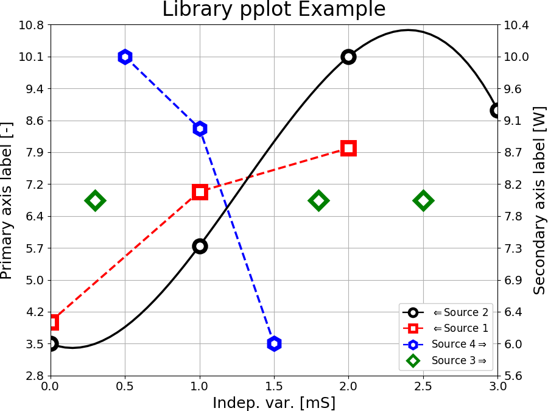

.. README.rst
.. Copyright (c) 2013-2019 Pablo Acosta-Serafini
.. See LICENSE for details
.. [REMOVE START]
.. [[[cog
.. # Standard library imports
.. import os
.. import sys
.. import textwrap
.. # PyPI imports
.. import pmisc
.. import docs.support.requirements_to_rst
.. SDIR = os.path.dirname(os.path.dirname(os.path.abspath(cog.inFile)))
.. sys.path.append(SDIR)
.. import pypkg.functions
.. FILE_NAME = sys.modules['docs.support.requirements_to_rst'].__file__
.. MDIR = os.path.join(os.path.realpath(
..    os.path.dirname(os.path.dirname(os.path.dirname(FILE_NAME))))
.. )
.. PKG_NAME = pypkg.functions.get_pkg_name()
.. PKG_VER = pypkg.functions.get_pkg_version()
.. PKG_INTERPS = pypkg.functions.get_supported_interps()
.. PKG_LONG_DESC = pypkg.functions.get_pkg_long_desc()
.. PKG_PIPELINE_ID = str(pypkg.functions.get_pkg_pipeline_id())
.. LINE_LENGTH = 78
.. PKG_INTERPS_STR = str(PKG_INTERPS[0]) if len(PKG_INTERPS) == 1 else ", ".join(PKG_INTERPS[:-1])+ " and " + PKG_INTERPS[-1]
.. def wrap(text, hanging_indent=0):
..     for line in textwrap.wrap(text, width=LINE_LENGTH, subsequent_indent=' '*hanging_indent):
..         cog.outl(line)
.. def tox_targets(prefix):
..     interps = ["``py"+str(interp).replace(".", "")+"-"+prefix+"``" for interp in PKG_INTERPS]
..     return interps[0] if len(interps) == 1 else ", ".join(interps[:-1])+ " and " + interps[-1]
.. cog.outl(".. [REMOVE STOP]")
.. cog.outl("")
.. cog.outl(".. image:: https://badge.fury.io/py/"+PKG_NAME+".svg")
.. cog.outl("    :target: https://pypi.org/project/"+PKG_NAME+"")
.. cog.outl("    :alt: PyPI version")
.. cog.outl("")
.. cog.outl(".. image:: https://img.shields.io/pypi/l/"+PKG_NAME+".svg")
.. cog.outl("    :target: https://pypi.org/project/"+PKG_NAME+"")
.. cog.outl("    :alt: License")
.. cog.outl("")
.. cog.outl(".. image:: https://img.shields.io/pypi/pyversions/"+PKG_NAME+".svg")
.. cog.outl("    :target: https://pypi.org/project/"+PKG_NAME+"")
.. cog.outl("    :alt: Python versions supported")
.. cog.outl("")
.. cog.outl(".. image:: https://img.shields.io/pypi/format/"+PKG_NAME+".svg")
.. cog.outl("    :target: https://pypi.org/project/"+PKG_NAME+"")
.. cog.outl("    :alt: Format")
.. cog.outl("")
.. cog.outl("|")
.. cog.outl("")
.. cog.outl(".. image::")
.. cog.outl("    https://dev.azure.com/pmasdev/"+PKG_NAME+"/_apis/build/status/pmacosta."+PKG_NAME+"?branchName=master")
.. cog.outl("    :target: https://dev.azure.com/pmasdev/"+PKG_NAME+"/_build?definitionId="+PKG_PIPELINE_ID+"&_a=summary")
.. cog.outl("    :alt: Continuous integration test status")
.. cog.outl("")
.. cog.outl(".. image::")
.. cog.outl("    https://img.shields.io/azure-devops/coverage/pmasdev/"+PKG_NAME+"/"+PKG_PIPELINE_ID+".svg")
.. cog.outl("    :target: https://dev.azure.com/pmasdev/"+PKG_NAME+"/_build?definitionId="+PKG_PIPELINE_ID+"&_a=summary")
.. cog.outl("    :alt: Continuous integration test coverage")
.. cog.outl("")
.. cog.outl(".. image::")
.. cog.outl("    https://readthedocs.org/projects/pip/badge/?version=stable")
.. cog.outl("    :target: https://pip.readthedocs.io/en/stable/?badge=stable")
.. cog.outl("    :alt: Documentation status")
.. cog.outl("")
.. cog.outl("|")
.. cog.outl("")
.. cog.outl("Description")
.. cog.outl("===========")
.. cog.outl("")
.. cog.outl(".. role:: bash(code)")
.. cog.outl("	:language: bash")
.. cog.outl("")
.. docs.support.requirements_to_rst.def_links(cog)
.. cog.outl("")
.. cog.outl("")
.. for paragraph in PKG_LONG_DESC.split(os.linesep):
..     if paragraph.strip():
..         wrap(paragraph)
..     else:
..         cog.outl("")
.. cog.outl("Interpreter")
.. cog.outl("===========")
.. cog.outl("")
.. blurb = (
..     "The package has been developed and tested with Python {0} "
..     "under Linux (Debian, Ubuntu), Apple macOS and Microsoft Windows"
.. )
.. wrap(blurb.format(PKG_INTERPS_STR))
.. cog.outl("")
.. cog.outl("Installing")
.. cog.outl("==========")
.. cog.outl("")
.. cog.outl(".. code-block:: console")
.. cog.outl("")
.. cog.outl("	$ pip install "+PKG_NAME)
.. cog.outl("")
.. cog.outl("Documentation")
.. cog.outl("=============")
.. cog.outl("")
.. wrap("Available at `Read the Docs <https://"+PKG_NAME+".readthedocs.io>`_")
.. cog.outl("")
.. cog.outl("Contributing")
.. cog.outl("============")
.. cog.outl("")
.. cog.outl("1. Abide by the adopted `code of conduct")
.. cog.outl("   <https://www.contributor-covenant.org/version/1/4/code-of-conduct>`_")
.. cog.outl("")
.. blurb = (
..     "2. Fork the `repository <https://github.com/pmacosta/"+PKG_NAME+">`_ from "
..     "GitHub and then clone personal copy [#f1]_:"
.. )
.. wrap(blurb, 3)
.. cog.outl("")
.. cog.outl("    .. code-block:: console")
.. cog.outl("")
.. cog.outl("        $ github_user=myname")
.. cog.outl("        $ git clone --recurse-submodules \\")
.. cog.outl("              https://github.com/\"${github_user}\"/"+PKG_NAME+".git")
.. cog.outl("        Cloning into '"+PKG_NAME+"'...")
.. cog.outl("        ...")
.. cog.outl("        $ cd "+PKG_NAME+" || exit 1")
.. cog.outl("        $ export "+PKG_NAME.upper()+"_DIR=${PWD}")
.. cog.outl("        $")
.. cog.outl("")
.. cog.outl("3. The package uses two sub-modules: a set of custom Pylint plugins to help with")
.. cog.outl("   some areas of code quality and consistency (under the ``pylint_plugins``")
.. cog.outl("   directory), and a lightweight package management framework (under the")
.. cog.outl("   ``pypkg`` directory). Additionally, the `pre-commit framework")
.. cog.outl("   <https://pre-commit.com/>`_ is used to perform various pre-commit code")
.. cog.outl("   quality and consistency checks. To enable the pre-commit hooks:")
.. cog.outl("")
.. cog.outl("    .. code-block:: console")
.. cog.outl("")
.. cog.outl("        $ cd \"${"+PKG_NAME.upper()+"_DIR}\" || exit 1")
.. cog.outl("        $ pre-commit install")
.. cog.outl("        pre-commit installed at .../"+PKG_NAME+"/.git/hooks/pre-commit")
.. cog.outl("        $")
.. cog.outl("")
.. cog.outl("4. Ensure that the Python interpreter can find the package modules")
.. cog.outl("   (update the :bash:`$PYTHONPATH` environment variable, or use")
.. cog.outl("   `sys.paths() <https://docs.python.org/3/library/sys.html#sys.path>`_,")
.. cog.outl("   etc.)")
.. cog.outl("")
.. cog.outl("   .. code-block:: console")
.. cog.outl("")
.. cog.outl("       $ export PYTHONPATH=${PYTHONPATH}:${"+PKG_NAME.upper()+"_DIR}")
.. cog.outl("       $")
.. cog.outl("")
.. cog.outl("5. Install the dependencies (if needed, done automatically by pip):")
.. docs.support.requirements_to_rst.proc_requirements(cog)
.. cog.outl("6. Implement a new feature or fix a bug")
.. cog.outl("")
.. cog.outl("7. Write a unit test which shows that the contributed code works as expected.")
.. cog.outl("   Run the package tests to ensure that the bug fix or new feature does not")
.. cog.outl("   have adverse side effects. If possible achieve 100\% code and branch")
.. cog.outl("   coverage of the contribution. Thorough package validation")
.. cog.outl("   can be done via Tox and Pytest:")
.. cog.outl("")
.. cog.outl("   .. code-block:: console")
.. cog.outl("")
.. cog.outl("       $ PKG_NAME="+PKG_NAME+" tox")
.. cog.outl("       GLOB sdist-make: .../"+PKG_NAME+"/setup.py")
.. cog.outl("       py27-pkg create: .../"+PKG_NAME+"/.tox/py27")
.. cog.outl("       py27-pkg installdeps: -r.../"+PKG_NAME+"/requirements/tests_py27.pip, -r.../"+PKG_NAME+"/requirements/docs_py27.pip")
.. cog.outl("       ...")
.. for pyver in PKG_INTERPS:
..     cog.outl("         py{0}-pkg: commands succeeded".format(str(pyver).replace(".", "")))
.. cog.outl("         congratulations :)")
.. cog.outl("       $")
.. cog.outl("")
.. cog.outl("   `Setuptools <https://bitbucket.org/pypa/setuptools>`_ can also be used")
.. cog.outl("   (Tox is configured as its virtual environment manager):")
.. cog.outl("")
.. cog.outl("   .. code-block:: console")
.. cog.outl("")
.. cog.outl("       $ PKG_NAME="+PKG_NAME+" python setup.py tests")
.. cog.outl("       running tests")
.. cog.outl("       running egg_info")
.. cog.outl("       writing "+PKG_NAME+".egg-info/PKG-INFO")
.. cog.outl("       writing dependency_links to "+PKG_NAME+".egg-info/dependency_links.txt")
.. cog.outl("       writing requirements to "+PKG_NAME+".egg-info/requires.txt")
.. cog.outl("       ...")
.. for pyver in PKG_INTERPS:
..     cog.outl("         py{0}-pkg: commands succeeded".format(str(pyver).replace(".", "")))
.. cog.outl("         congratulations :)")
.. cog.outl("       $")
.. cog.outl("")
.. blurb = (
..     "Tox (or Setuptools via Tox) runs with the following default environments: "+
..     tox_targets("pkg")+" [#f3]_. These use "+
..     "the "+PKG_INTERPS_STR+" interpreters, respectively, to test all code in the "+
..     "documentation (both in Sphinx ``*.rst`` source files and in docstrings), run "+
..     "all unit tests, measure test coverage and re-build the exceptions "+
..     "documentation. To pass arguments to Pytest (the test runner) use a double "+
..     "dash (``--``) after all the Tox arguments, for example:"
.. )
.. wrap((" "*3)+blurb, hanging_indent=3)
.. cog.outl("")
.. cog.outl("   .. code-block:: console")
.. cog.outl("")
.. cog.outl("       $ PKG_NAME="+PKG_NAME+" tox -e py27-pkg -- -n 4")
.. cog.outl("       GLOB sdist-make: .../"+PKG_NAME+"/setup.py")
.. cog.outl("       py27-pkg inst-nodeps: .../"+PKG_NAME+"/.tox/.tmp/package/1/"+PKG_NAME+"-"+PKG_VER+".zip")
.. cog.outl("       ...")
.. cog.outl("         py27-pkg: commands succeeded")
.. cog.outl("         congratulations :)")
.. cog.outl("       $")
.. cog.outl("")
.. cog.outl("   Or use the :code:`-a` Setuptools optional argument followed by a quoted")
.. cog.outl("   string with the arguments for Pytest. For example:")
.. cog.outl("")
.. cog.outl("   .. code-block:: console")
.. cog.outl("")
.. cog.outl("       $ PKG_NAME="+PKG_NAME+" python setup.py tests -a \"-e py27-pkg -- -n 4\"")
.. cog.outl("       running tests")
.. cog.outl("       ...")
.. cog.outl("         py27-pkg: commands succeeded")
.. cog.outl("         congratulations :)")
.. cog.outl("       $")
.. cog.outl("")
.. cog.outl("   There are other convenience environments defined for Tox [#f3]_:")
.. cog.outl("")
.. blurb = (
..     "* "+tox_targets("repl")+" run the Python "+PKG_INTERPS_STR+" "+
..     "REPL, respectively, in the appropriate virtual "+
..     "environment. The ``"+PKG_NAME+"`` package is pip-installed by Tox when the "+
..     "environments are created.  Arguments to the interpreter can be passed in "+
..     "the command line after a double dash (``--``)."
.. )
.. wrap((" "*4)+blurb, hanging_indent=6)
.. cog.outl("")
.. blurb = (
..     "* "+tox_targets("test")+" run Pytest "+
..     "using the Python "+PKG_INTERPS_STR+" interpreter, "+
..     "respectively, in the appropriate virtual environment. Arguments to pytest "+
..     "can be passed in the command line after a double dash (``--``) , for "+
..     "example:"
.. )
.. wrap((" "*4)+blurb, hanging_indent=6)
.. cog.outl("")
.. cog.outl("      .. code-block:: console")
.. cog.outl("")
.. cog.outl("       $ PKG_NAME="+PKG_NAME+" tox -e py27-test -- -x test_"+PKG_NAME+".py")
.. cog.outl("       GLOB sdist-make: .../"+PKG_NAME+"/setup.py")
.. cog.outl("       py27-pkg inst-nodeps: .../"+PKG_NAME+"/.tox/.tmp/package/1/"+PKG_NAME+"-"+PKG_VER+".zip")
.. cog.outl("       ...")
.. cog.outl("         py27-pkg: commands succeeded")
.. cog.outl("         congratulations :)")
.. cog.outl("       $")
.. PY_LIST = "``"+str(PKG_INTERPS[0])+"``" if len(PKG_INTERPS) == 1 else ", ".join(["``"+str(item)+"``" for item in PKG_INTERPS[:-1]])+" or ``"+str(PKG_INTERPS[-1])+"``"
.. blurb = (
..     "* "+tox_targets("test")+" test code and "+
..     "branch coverage using the "+PKG_INTERPS_STR+" interpreter, respectively, "+
..     "in the appropriate virtual environment. Arguments to pytest can be passed "+
..     "in the command line after a double dash (``--``). The report can be found "+
..     "in "+
..     ":bash:`${"+PKG_NAME.upper()+"_DIR}/.tox/py[PV]/usr/share/"+PKG_NAME+"/tests/htmlcov/index.html` "+
..     "where ``[PV]`` stands for "+PY_LIST+" depending on "+
..     "the interpreter used."
.. )
.. wrap((" "*4)+blurb, hanging_indent=6)
.. cog.outl("")
.. cog.outl("8. Verify that continuous integration tests pass. The package has continuous")
.. cog.outl("   integration configured for Linux, Apple macOS and Microsoft Windows (all via")
.. cog.outl("   `Azure DevOps <https://dev.azure.com/pmasdev>`_).")
.. cog.outl("")
.. cog.outl("9. Document the new feature or bug fix (if needed). The script")
.. cog.outl("   :bash:`${"+PKG_NAME.upper()+"_DIR}/pypkg/build_docs.py` re-builds the whole package")
.. cog.outl("   documentation (re-generates images, cogs source files, etc.):")
.. cog.outl("")
.. pmisc.ste('"${'+PKG_NAME.upper()+'_DIR}"/pypkg/build_docs.py -h', 3, MDIR, cog.out, env={PKG_NAME.upper()+"_DIR":MDIR})
.. cog.outl(".. rubric:: Footnotes")
.. cog.outl("")
.. cog.outl(".. [#f1] All examples are for the `bash <https://www.gnu.org/software/bash/>`_")
.. cog.outl("   shell")
.. cog.outl("")
.. cog.outl(".. [#f2] It is assumed that all the Python interpreters are in the executables")
.. cog.outl("   path. Source code for the interpreters can be downloaded from Python's main")
.. cog.outl("   `site <https://www.python.org/downloads/>`_")
.. cog.outl("")
.. cog.outl(".. [#f3] Tox configuration largely inspired by")
.. cog.outl("   `Ionel's codelog <https://blog.ionelmc.ro/2015/04/14/")
.. cog.outl("   tox-tricks-and-patterns/>`_")
.. cog.outl("")
.. cog.outl(".. include:: ../CHANGELOG.rst")
.. cog.outl("")
.. cog.outl("License")
.. cog.outl("=======")
.. cog.outl("")
.. cog.outl(".. include:: ../LICENSE")
.. cog.outl("")
.. cog.outl(".. [REMOVE START]")
.. ]]]
.. [REMOVE STOP]

.. image:: https://badge.fury.io/py/pplot.svg
    :target: https://pypi.org/project/pplot
    :alt: PyPI version

.. image:: https://img.shields.io/pypi/l/pplot.svg
    :target: https://pypi.org/project/pplot
    :alt: License

.. image:: https://img.shields.io/pypi/pyversions/pplot.svg
    :target: https://pypi.org/project/pplot
    :alt: Python versions supported

.. image:: https://img.shields.io/pypi/format/pplot.svg
    :target: https://pypi.org/project/pplot
    :alt: Format

|

.. image::
    https://dev.azure.com/pmasdev/pplot/_apis/build/status/pmacosta.pplot?branchName=master
    :target: https://dev.azure.com/pmasdev/pplot/_build?definitionId=8&_a=summary
    :alt: Continuous integration test status

.. image::
    https://img.shields.io/azure-devops/coverage/pmasdev/pplot/8.svg
    :target: https://dev.azure.com/pmasdev/pplot/_build?definitionId=8&_a=summary
    :alt: Continuous integration test coverage

.. image::
    https://readthedocs.org/projects/pip/badge/?version=stable
    :target: https://pip.readthedocs.io/en/stable/?badge=stable
    :alt: Documentation status

|

Description
===========

.. role:: bash(code)
	:language: bash

.. _Cog: https://nedbatchelder.com/code/cog
.. _Coverage: https://coverage.readthedocs.io
.. _Decorator: https://raw.githubusercontent.com/micheles/decorator/mast
   er/docs/documentation.md
.. _Docutils: http://docutils.sourceforge.net/docs
.. _Funcsigs: https://pypi.org/project/funcsigs
.. _Imageio: http://imageio.github.io
.. _Matplotlib: https://matplotlib.org
.. _Mock: https://docs.python.org/3/library/unittest.mock.html
.. _Numpy: http://www.numpy.org
.. _Pcsv: https://pcsv.readthedocs.org
.. _Peng: https://peng.readthedocs.org
.. _Pexdoc: https://pexdoc.readthedocs.org
.. _Pillow: https://python-pillow.org
.. _Pmisc: http://pmisc.readthedocs.org
.. _PyContracts: https://andreacensi.github.io/contracts
.. _Pydocstyle: http://www.pydocstyle.org
.. _Pylint: https://www.pylint.org
.. _Py.test: http://pytest.org
.. _Pytest-coverage: https://pypi.org/project/pytest-cov
.. _Pytest-pmisc: https://pytest-pmisc.readthedocs.org
.. _Pytest-xdist: https://pypi.org/project/pytest-xdist
.. _Scipy: https://www.scipy.org
.. _Six: https://pythonhosted.org/six
.. _Sphinx: http://sphinx-doc.org
.. _ReadTheDocs Sphinx theme: https://github.com/rtfd/sphinx_rtd_theme
.. _Inline Syntax Highlight Sphinx Extension:
   https://bitbucket.org/klorenz/sphinxcontrib-inlinesyntaxhighlight
.. _Shellcheck Linter Sphinx Extension:
   https://pypi.org/project/sphinxcontrib-shellcheck
.. _Tox: https://testrun.org/tox
.. _Virtualenv: https://docs.python-guide.org/dev/virtualenvs

This module can be used to create high-quality, presentation-ready X-Y graphs
quickly and easily

***************
Class hierarchy
***************

The properties of the graph (figure in Matplotlib parlance) are defined in an
object of the :py:class:`pplot.Figure` class.

Each figure can have one or more panels, whose properties are defined by
objects of the :py:class:`pplot.Panel` class. Panels are arranged vertically
in the figure and share the same independent axis.  The limits of the
independent axis of the figure result from the union of the limits of the
independent axis of all the panels. The independent axis is shown by default
in the bottom-most panel although it can be configured to be in any panel or
panels.

Each panel can have one or more data series, whose properties are defined by
objects of the :py:class:`pplot.Series` class. A series can be associated with
either the primary or secondary dependent axis of the panel. The limits of the
primary and secondary dependent axis of the panel result from the union of the
primary and secondary dependent data points of all the series associated with
each axis. The primary axis is shown on the left of the panel and the
secondary axis is shown on the right of the panel. Axes can be linear or
logarithmic.

The data for a series is defined by a source. Two data sources are provided:
the :py:class:`pplot.BasicSource` class provides basic data validation and
minimum/maximum independent variable range bounding. The
:py:class:`pplot.CsvSource` class builds upon the functionality of the
:py:class:`pplot.BasicSource` class and offers a simple way of accessing data
from a comma-separated values (CSV) file.  Other data sources can be
programmed by inheriting from the :py:class:`pplot.functions.DataSource`
abstract base class (ABC). The custom data source needs to implement the
following methods: :code:`__str__`, :code:`_set_indep_var` and
:code:`_set_dep_var`. The latter two methods set the contents of the
independent variable (an increasing real Numpy vector) and the dependent
variable (a real Numpy vector) of the source, respectively.

.. [REMOVE START]

**Figure 1:** Example diagram of the class hierarchy of a figure. In this
particular example the figure consists of 3 panels. Panel 1 has a series whose
data comes from a basic source, panel 2 has three series, two of which come
from comma-separated values (CSV) files and one that comes from a basic
source. Panel 3 has one series whose data comes from a basic source.

.. [REMOVE STOP]

***************
Axes tick marks
***************

Axes tick marks are selected so as to create the most readable graph. Two
global variables control the actual number of ticks,
:py:data:`pplot.constants.MIN_TICKS` and
:py:data:`pplot.constants.SUGGESTED_MAX_TICKS`. In general the number of ticks
are between these two bounds; one or two more ticks can be present if a data
series uses interpolation and the interpolated curve goes above (below) the
largest (smallest) data point. Tick spacing is chosen so as to have the most
number of data points "on grid". Engineering notation (i.e. 1K = 1000, 1m =
0.001, etc.) is used for the axis tick marks.

*******
Example
*******

.. literalinclude:: ./support/plot_example_1.py
    :language: python
    :tab-width: 4
    :lines: 1,6-115

|

.. [REMOVE START]
.. csv-table:: data.csv file
   :file: ./support/data.csv
   :header-rows: 1

|

**Figure 2:** plot_example_1.png generated by plot_example_1.py

|

.. [REMOVE STOP]

Interpreter
===========

The package has been developed and tested with Python 2.7, 3.5, 3.6 and 3.7
under Linux (Debian, Ubuntu), Apple macOS and Microsoft Windows

Installing
==========

.. code-block:: console

	$ pip install pplot

Documentation
=============

Available at `Read the Docs <https://pplot.readthedocs.io>`_

Contributing
============

1. Abide by the adopted `code of conduct
   <https://www.contributor-covenant.org/version/1/4/code-of-conduct>`_

2. Fork the `repository <https://github.com/pmacosta/pplot>`_ from GitHub and
   then clone personal copy [#f1]_:

    .. code-block:: console

        $ github_user=myname
        $ git clone --recurse-submodules \
              https://github.com/"${github_user}"/pplot.git
        Cloning into 'pplot'...
        ...
        $ cd pplot || exit 1
        $ export PPLOT_DIR=${PWD}
        $

3. The package uses two sub-modules: a set of custom Pylint plugins to help with
   some areas of code quality and consistency (under the ``pylint_plugins``
   directory), and a lightweight package management framework (under the
   ``pypkg`` directory). Additionally, the `pre-commit framework
   <https://pre-commit.com/>`_ is used to perform various pre-commit code
   quality and consistency checks. To enable the pre-commit hooks:

    .. code-block:: console

        $ cd "${PPLOT_DIR}" || exit 1
        $ pre-commit install
        pre-commit installed at .../pplot/.git/hooks/pre-commit
        $

4. Ensure that the Python interpreter can find the package modules
   (update the :bash:`$PYTHONPATH` environment variable, or use
   `sys.paths() <https://docs.python.org/3/library/sys.html#sys.path>`_,
   etc.)

   .. code-block:: console

       $ export PYTHONPATH=${PYTHONPATH}:${PPLOT_DIR}
       $

5. Install the dependencies (if needed, done automatically by pip):

    * `Cog`_ (2.5.1 or newer)

    * `Coverage`_ (4.5.3 or newer)

    * `Decorator`_ (4.4.0 or newer)

    * `Docutils`_ (0.14 or newer)

    * `Funcsigs`_ (Python 2.x only, 1.0.2 or newer)

    * `Imageio`_ (2.5.0 or newer)

    * `Inline Syntax Highlight Sphinx Extension`_ (0.2 or newer)

    * `Matplotlib`_ (3.0.3 or newer)

    * `Mock`_ (Python 2.x only, 2.0.0 or newer)

    * `Numpy`_ (1.16.2 or newer)

    * `Pcsv`_ (1.0.8 or newer)

    * `Peng`_ (1.0.9 or newer)

    * `Pexdoc`_ (1.1.4 or newer)

    * `Pillow`_ (5.4.1 or newer)

    * `Pmisc`_ (1.5.8 or newer)

    * `Py.test`_ (4.3.1 or newer)

    * `PyContracts`_ (1.8.2 or newer)

    * `Pydocstyle`_ (3.0.0 or newer)

    * `Pylint`_ (Python 2.x: 1.9.4 or newer, Python 3.x: 2.3.1 or newer)

    * `Pytest-coverage`_ (2.6.1 or newer)

    * `Pytest-pmisc`_ (1.0.7 or newer)

    * `Pytest-xdist`_ (optional, 1.26.1 or newer)

    * `ReadTheDocs Sphinx theme`_ (0.4.3 or newer)

    * `Scipy`_ (1.2.1 or newer)

    * `Shellcheck Linter Sphinx Extension`_ (1.0.8 or newer)

    * `Six`_ (1.12.0 or newer)

    * `Sphinx`_ (1.8.5 or newer)

    * `Tox`_ (3.7.0 or newer)

    * `Virtualenv`_ (16.4.3 or newer)

6. Implement a new feature or fix a bug

7. Write a unit test which shows that the contributed code works as expected.
   Run the package tests to ensure that the bug fix or new feature does not
   have adverse side effects. If possible achieve 100\% code and branch
   coverage of the contribution. Thorough package validation
   can be done via Tox and Pytest:

   .. code-block:: console

       $ PKG_NAME=pplot tox
       GLOB sdist-make: .../pplot/setup.py
       py27-pkg create: .../pplot/.tox/py27
       py27-pkg installdeps: -r.../pplot/requirements/tests_py27.pip, -r.../pplot/requirements/docs_py27.pip
       ...
         py27-pkg: commands succeeded
         py35-pkg: commands succeeded
         py36-pkg: commands succeeded
         py37-pkg: commands succeeded
         congratulations :)
       $

   `Setuptools <https://bitbucket.org/pypa/setuptools>`_ can also be used
   (Tox is configured as its virtual environment manager):

   .. code-block:: console

       $ PKG_NAME=pplot python setup.py tests
       running tests
       running egg_info
       writing pplot.egg-info/PKG-INFO
       writing dependency_links to pplot.egg-info/dependency_links.txt
       writing requirements to pplot.egg-info/requires.txt
       ...
         py27-pkg: commands succeeded
         py35-pkg: commands succeeded
         py36-pkg: commands succeeded
         py37-pkg: commands succeeded
         congratulations :)
       $

   Tox (or Setuptools via Tox) runs with the following default environments:
   ``py27-pkg``, ``py35-pkg``, ``py36-pkg`` and ``py37-pkg`` [#f3]_. These use
   the 2.7, 3.5, 3.6 and 3.7 interpreters, respectively, to test all code in
   the documentation (both in Sphinx ``*.rst`` source files and in
   docstrings), run all unit tests, measure test coverage and re-build the
   exceptions documentation. To pass arguments to Pytest (the test runner) use
   a double dash (``--``) after all the Tox arguments, for example:

   .. code-block:: console

       $ PKG_NAME=pplot tox -e py27-pkg -- -n 4
       GLOB sdist-make: .../pplot/setup.py
       py27-pkg inst-nodeps: .../pplot/.tox/.tmp/package/1/pplot-1.1.4.zip
       ...
         py27-pkg: commands succeeded
         congratulations :)
       $

   Or use the :code:`-a` Setuptools optional argument followed by a quoted
   string with the arguments for Pytest. For example:

   .. code-block:: console

       $ PKG_NAME=pplot python setup.py tests -a "-e py27-pkg -- -n 4"
       running tests
       ...
         py27-pkg: commands succeeded
         congratulations :)
       $

   There are other convenience environments defined for Tox [#f3]_:

    * ``py27-repl``, ``py35-repl``, ``py36-repl`` and ``py37-repl`` run the
      Python 2.7, 3.5, 3.6 and 3.7 REPL, respectively, in the appropriate
      virtual environment. The ``pplot`` package is pip-installed by Tox when
      the environments are created.  Arguments to the interpreter can be
      passed in the command line after a double dash (``--``).

    * ``py27-test``, ``py35-test``, ``py36-test`` and ``py37-test`` run Pytest
      using the Python 2.7, 3.5, 3.6 and 3.7 interpreter, respectively, in the
      appropriate virtual environment. Arguments to pytest can be passed in
      the command line after a double dash (``--``) , for example:

      .. code-block:: console

       $ PKG_NAME=pplot tox -e py27-test -- -x test_pplot.py
       GLOB sdist-make: .../pplot/setup.py
       py27-pkg inst-nodeps: .../pplot/.tox/.tmp/package/1/pplot-1.1.4.zip
       ...
         py27-pkg: commands succeeded
         congratulations :)
       $
    * ``py27-test``, ``py35-test``, ``py36-test`` and ``py37-test`` test code
      and branch coverage using the 2.7, 3.5, 3.6 and 3.7 interpreter,
      respectively, in the appropriate virtual environment. Arguments to
      pytest can be passed in the command line after a double dash (``--``).
      The report can be found in :bash:`${PPLOT_DIR}/.tox/py[PV]/usr/share/ppl
      ot/tests/htmlcov/index.html` where ``[PV]`` stands for ``2.7``, ``3.5``,
      ``3.6`` or ``3.7`` depending on the interpreter used.

8. Verify that continuous integration tests pass. The package has continuous
   integration configured for Linux, Apple macOS and Microsoft Windows (all via
   `Azure DevOps <https://dev.azure.com/pmasdev>`_).

9. Document the new feature or bug fix (if needed). The script
   :bash:`${PPLOT_DIR}/pypkg/build_docs.py` re-builds the whole package
   documentation (re-generates images, cogs source files, etc.):

   .. code-block:: console

       $ "${PPLOT_DIR}"/pypkg/build_docs.py -h
       usage: build_docs.py [-h] [-d DIRECTORY] [-r]
                            [-n NUM_CPUS] [-t]

       Build pplot package documentation

       optional arguments:
         -h, --help            show this help message and exit
         -d DIRECTORY, --directory DIRECTORY
                               specify source file directory
                               (default ../pplot)
         -r, --rebuild         rebuild exceptions documentation.
                               If no module name is given all
                               modules with auto-generated
                               exceptions documentation are
                               rebuilt
         -n NUM_CPUS, --num-cpus NUM_CPUS
                               number of CPUs to use (default: 1)
         -t, --test            diff original and rebuilt file(s)
                               (exit code 0 indicates file(s) are
                               identical, exit code 1 indicates
                               file(s) are different)

.. rubric:: Footnotes

.. [#f1] All examples are for the `bash <https://www.gnu.org/software/bash/>`_
   shell

.. [#f2] It is assumed that all the Python interpreters are in the executables
   path. Source code for the interpreters can be downloaded from Python's main
   `site <https://www.python.org/downloads/>`_

.. [#f3] Tox configuration largely inspired by
   `Ionel's codelog <https://blog.ionelmc.ro/2015/04/14/
   tox-tricks-and-patterns/>`_

.. include:: ../CHANGELOG.rst

License
=======

.. include:: ../LICENSE

.. [REMOVE START]
.. [[[end]]]
.. [REMOVE STOP]
